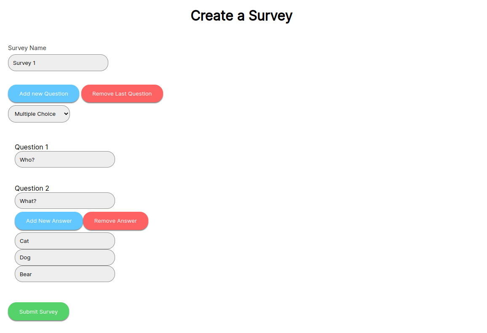
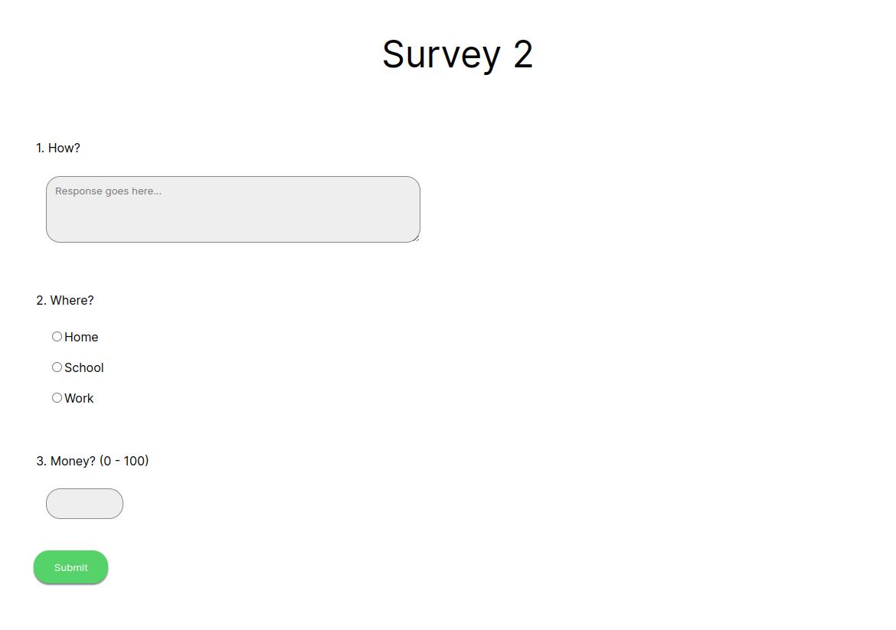
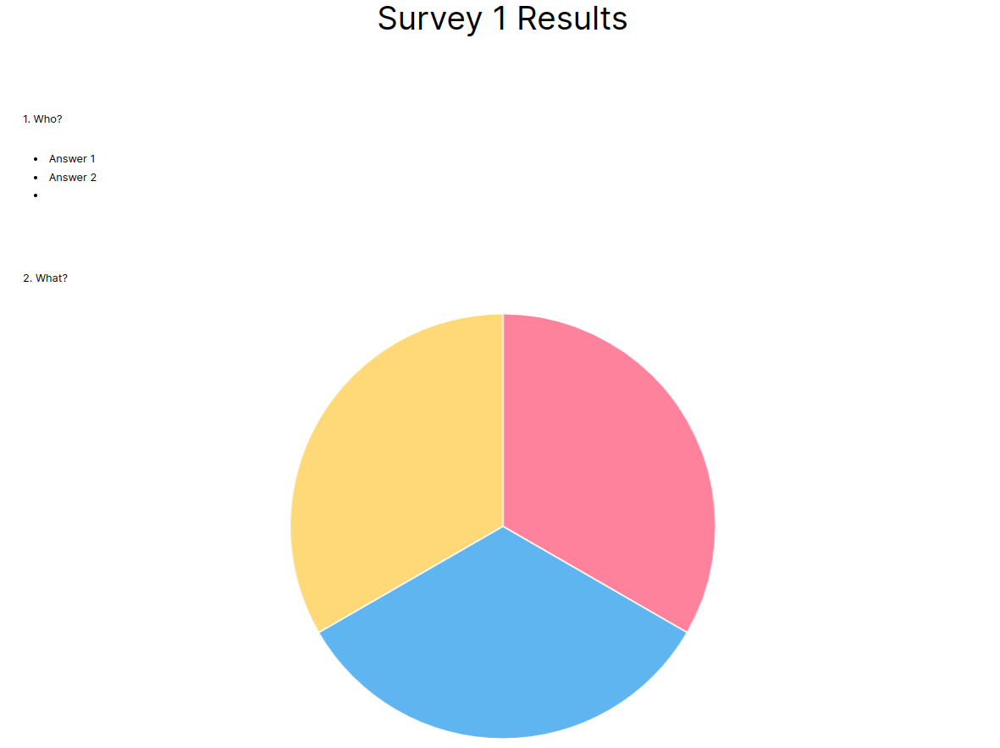

# SYSC4806 Project - Survey Website

*SYSC4806 Project - Group 19 - Winter 2023*

## About

This project consists of a survey website, where users can sign up and create surveys
with text, numeric range and multiple-choice questions.
Users can share links to surveys which can be responded to anonymously.
Users are able to view the responses to their surveys via an internal dashboard.

</img>

</img>

</img>

## Running

1. Clone this project and run `mvn clean verify package`
2. Run the generated jarfile in the `target` directory
3. Visit http://localhost:8080 in your browser

### Project Members

- Curtis Davies - 101146353
- Nick Sendyk - 101143602
- Ethan Houlahan - 101145675
- Tom Lumsden - 101148024

### Milestone 1

*8 March, 2023*

- Set up Spring Boot webserver
- Added database entities for persisted data including users, surveys and responses
- Added signup/login functionality for users
  - `/login`
  - `/signup`
- Added dashboard listing the surveys created by a user
  - `/`
- Added survey creation functionality with text, multiple-choice and numeric range questions
  - `/surveyCreation`
- Added functionality to respond to a survey, adding the response to the database
  - `/survey?id=<id>`
- Added ability to view survey responses and analytics from a webpage
  - `/results/<id>`

Links:

- [GitHub](https://github.com/110Percent/sysc4806-project)
- [Figma](https://www.figma.com/file/VD2XDoEXZeBCyS2xU30HgZ/SurveyMonkey)